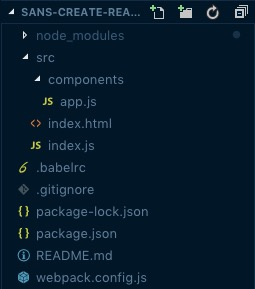

# sans-create-react-app
Riding React without training wheels

A template to learn the process of getting a React application off the ground without the baggage of everyone's favorite create-react-app CLI tool.

Credit to: https://medium.com/@paul.allies/react-create-app-without-react-create-app-7c8341282645

## Setting Up the initial project
To install the correct dependencies to begin, run the following from a project folder-

```
$> npm init
$> npm install --save react react-dom
$> npm install --save-dev webpack webpack-cli webpack-dev-server
$> npm install --save-dev babel babel-core babel-loader babel-preset-env babel-preset-react html-webpack-plugin http-server
```

The initial project structure:

